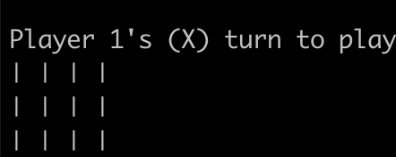

# Tic Tac Toe
⁣⭕❕⭕❕❌
➖➕➖➕➖
⭕❕⁣❌❕⭕
➖➕➖➕➖
❌❕❌❕⭕
The classic game as a Python program with an AI player. The board and resulting moves are printed onto stdout.  
Run the program with `python3 game.py`. The program will prompt the user to choose from 3 possible modes:   
1: two people.  
2: person vs AI player.  
3: two AI players.  
  
After the mode is chose, the user, who will be identified as Player 1, will choose to play with either 'X' or 'O', after which the game will begin.  
If the chosen mode includes a human player, that player will be prompted to choose a number between 1 and 9 corresponding to the slot on the board the player
wants to place their sign in. If the chosen slot is not empty, the player must choose a new slot.
 
## The AI Player
The AI player for this game is written using the __minimax algorithm__. The minimax() function goes through each possible
move simulating all possible outcomes and returns the best move for the AI player to play.  
In more detail, the program works the following way: minimax() deepdives into minim_value() or maxim_value() depending if the current player is the 
maximizing player (X). Then the program alternates recursively between maxim_value() and minim_value()
pretending to be the opponent. minim_value() and maxim_value() return -1, 0 or 1 depending on 
who won the game in that one simulation. Ultimately, minimax() will save the value and the move
most favorable for the current player. If multiple moves result in the same (best) outcome,
the first one simulated will be returned.  
I originally wrote the AI player section of this program for the Harvard ai50 course, but I wanted to write a complete game with multiple play modes.
  
Here's a screen recording of two AI players battling it out:  

